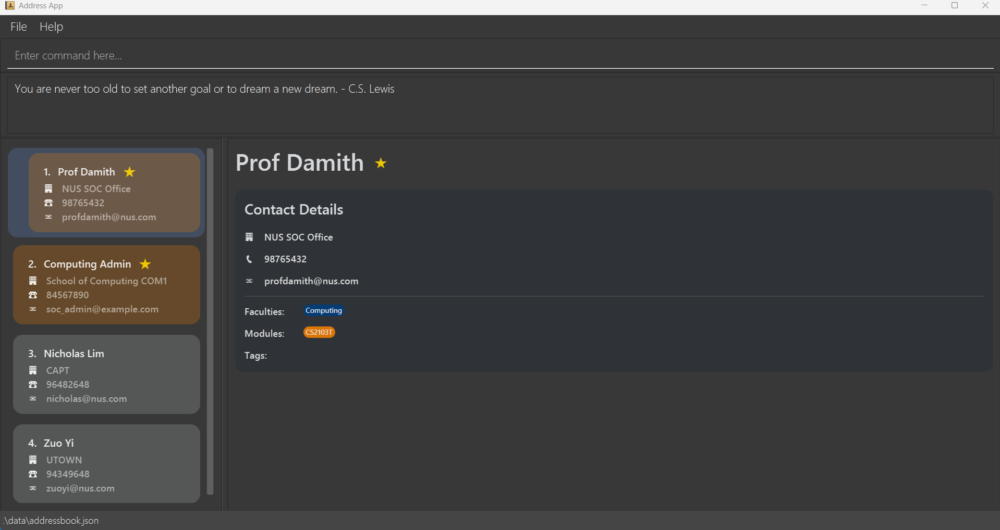

# CampusBook User Guide

## Introduction

CampusBook is a **desktop app for managing contacts, optimized for NUS Students' usage via a Command Line Interface** (CLI) while still having the benefits of a Graphical User Interface (GUI). 

With features like a **motivational message** to cheer you up everytime you start the application, as well as **pre-loaded NUS faculty admin contact details** you can easily add into your CampusBook, it is definitely the choice for NUS students to manage contacts in a single application.

Moreover, features like **command aliases** can optimize and improve the efficiency of typing, empowering you to add contacts with efficiency and customisability.

If you are an **NUS student** looking for a **centralised and efficient** contact management application... then look no further because CampusBook is here!

> ***CampusBook - Connect Smarter, Study Harder.***

<!-- * Table of Contents -->
## Table of Contents
1. [Quick Start](#quick-start)
2. [Features](#features)
3. [FAQ](#faq)
4. [Known Issues](#known-issues)

<page-nav-print />

--------------------------------------------------------------------------------------------------------------------

## Quick start

1. Ensure you have Java `17` or above installed in your Computer. 
   **Mac users:** Ensure you have the precise JDK version prescribed [here](https://se-education.org/guides/tutorials/javaInstallationMac.html).

2. Download the latest `.jar` file from [here](https://github.com/AY2526S1-CS2103T-T17-2/tp/releases).

3. Copy the file to the folder you want to use as the _home folder_ for your CampusBook.

4. Open a command terminal, `cd` into the folder you put the jar file in, and use the `java -jar CampusBook.jar` command to run the application. 
   A GUI similar to the below should appear in a few seconds. Note how the app contains some sample data. This is the default data when you start the application for the first time. 
   

5. Type the command in the command box and press Enter to execute it. e.g. typing **`help`** and pressing Enter will open the help window. 
   Some example commands you can try:

   * `list` : Lists all contacts.

   * `add n/John Doe p/98765432 e/johnd@example.com a/John street, block 123, #01-01` : Adds a contact named `John Doe` to the Address Book.

   * `delete 3` : Deletes the 3rd contact shown in the current list.

   * `clear` : Deletes all contacts.

   * `exit` : Exits the app.

6. Refer to the [Features](#features) below for details of each command.

--------------------------------------------------------------------------------------------------------------------

## Features
1. [Startup Motivtional Message](#startup-motivational-message)
2. [Command List:](#commands)
   1. [`help`: Viewing Help](#viewing-help--help)
   2. [`add`: Adding a Person](#adding-a-person-add)
   3. [`select`: Selecting a Faculty](#selecting-a-faculty-to-preload-contacts-select)
   4. [`list`: Listing all Persons](#listing-all-persons--list)
   5. [`edit`: Editing a Person](#editing-a-person--edit)
   6. [`find`: Locating Persons by Fields](#locating-persons-by-name-find)
   7. [`delete`: Deleting a Person](#deleting-a-person--delete)
   8. [`clear`: Clearing all Entries](#clearing-all-entries--clear)
   9. [`fav`: Marking a Contact as Favorite](#marking-a-contact-as-favorite-fav)
   10. [`unfav`: Unmarking a Favorite Contact](#unmarking-a-favorite-contact-unfav)
   11. [`export`: Exporting Data](#exporting-data--export)
   12. [`import`: Importing Data](#importing-data--import)
   13. [`alias`: Creating an Alias](#creating-a-command-alias-alias)
   14. [`unalias`: Removing an Alias](#removing-a-command-alias-unalias)
   15. [`listaliases`: Listing all Aliases](#listing-all-aliases-listaliases)
   16. [`exit`: Exiting the Program](#exiting-the-program--exit)
3. [Command Summary](#command-summary)
4. [Fields: Types of Information](#how-fields-work)
5. [Contact Details Panel](#contact-details-panel)
6. [Autocomplete commands and path files]()
7. [Command History Navigation](#command-history-navigation)
8. [Saving the Data](#saving-the-data)
9. [Editing the Data File](#editing-the-data-file)
--------------------------------------------------------------------------------------------------------------------
## Startup Motivational Message

Being a student is tough. We totally understand.

Hence, when you launch CampusBook, a different motivational quote will appear in the result display area to give you a little boost of encouragement for your day:

<box type="info" seamless>
This message is shown only at startup and will be replaced by the output of the first command you execute.
</box>

## Commands

### Viewing help : `help`

Shows a message explaining how to access the help page.

Format: `help`

--------------------------------------------------------------------------------------------------------------------

### Adding a person: `add`

Adds a person to the address book.

Format: `add n/NAME p/PHONE_NUMBER e/EMAIL a/ADDRESS [t/TAG]… [f/FACULTY]…[m/MODULE]… [fav/FAVORITE]…​`

<box type="tip" seamless>

**Tip:** A person can have any number of tags/faculties/modules (including 0)
</box>

Examples:
* `add n/John Doe p/98765432 e/johnd@example.com a/John street, block 123, #01-01 f/Computing m/CS2103T`
* `add n/Betsy Crowe t/friend e/betsycrowe@example.com a/Newgate Prison p/1234567 t/criminal fav/true`

--------------------------------------------------------------------------------------------------------------------

### Selecting a Faculty to Preload Contacts: `select`

Preloads a list of default administrative contacts for a specified NUS faculty. This is a convenient way to quickly add important university contacts to your address book.

Format: `select FACULTY`

* Preloads contacts for the given `FACULTY`.
* The `FACULTY` name must be one of the official NUS faculty names. The command will provide a list of valid faculties if an invalid one is entered.
* If any of the contacts to be preloaded already exist in your address book, they will be skipped to avoid duplicates. A warning will be shown for any skipped contacts.

Examples:
* `select Engineering` preloads the contacts for the Faculty of Engineering.
* `select Computing` preloads the contacts for the School of Computing.

--------------------------------------------------------------------------------------------------------------------

### Listing all persons : `list`

Shows a list of all persons in the address book.

Format: `list`

--------------------------------------------------------------------------------------------------------------------

### Editing a person : `edit`

Edits an existing person in the address book.

Format: `edit INDEX [n/NAME] [p/PHONE] [e/EMAIL] [a/ADDRESS] [t/TAG]…​ [f/FACULTY]…​ [m/MODULE]…​ [fav/FAVORITE]`

* Edits the person at the specified `INDEX`. The index refers to the index number shown in the displayed person list. The index **must be a positive integer** 1, 2, 3, …​
* At least one of the optional fields must be provided.
* Existing values will be updated to the input values.
* When editing tags, the existing tags of the person will be removed i.e adding of tags is not cumulative.
* You can remove all the person's tags by typing `t/` without
    specifying any tags after it.
* To mark a contact as favorite, use `fav/true`. To unmark, use `fav/false`.

Examples:
*  `edit 1 p/91234567 e/johndoe@example.com` Edits the phone number and email address of the 1st person to be `91234567` and `johndoe@example.com` respectively.
*  `edit 2 n/Betsy Crower t/` Edits the name of the 2nd person to be `Betsy Crower` and clears all existing tags.
*  `edit 3 fav/true` Marks the 3rd person as a favorite contact.

--------------------------------------------------------------------------------------------------------------------

### Locating persons by multiple criteria: `find`

Finds all persons who match all of the specified criteria.

Format: `find [n/NAME_KEYWORD [MORE_KEYWORDS]...] [t/TAG_KEYWORD [MORE_KEYWORDS]...] [m/MODULE_KEYWORD [MORE_KEYWORDS]...] [f/FACULTY_KEYWORD [MORE_KEYWORDS]...]`

* At least one parameter(among name,tag,module,faculty) must be provided.
* The search is case-insensitive for all fields.
* For a given field (e.g., name), the search is an `OR` search. It will match persons who have at least one of the keywords. e.g., `n/alex john` will find persons named `Alex` OR `John`.
* Across different fields (e.g., name and tag), the search is an `AND` search. It will only match persons who satisfy the criteria for all provided fields.
* Only full words will be matched e.g. `n/Han` will not match a person named `Hans`.

<box type="warning" seamless>

**Caution:**
The keywords for each field are separated by spaces. If you mistype a prefix (e.g., `ff/` instead of `f/`), it might be treated as a keyword for the previous field, leading to unexpected results. For example, `find n/alex ff/medicine` will be interpreted as searching for a person whose name contains `alex` OR `ff/medicine`. Stricter validation for prefixes will be considered in a future version.
</box>

Examples:
* `find n/John` returns all persons whose name contains `John`.
* `find t/friend colleague` returns all persons tagged with `friend` OR `colleague`.
* `find n/alex david t/friend` returns all persons whose name contains `Alex` OR `David` AND are tagged as a `friend`.

--------------------------------------------------------------------------------------------------------------------

### Deleting a person : `delete`

Deletes the specified person from the address book. This can be done in two ways: by index or by criteria.

**Option 1: Delete by index**

Format: `delete INDEX`

* Deletes the person at the specified `INDEX`.
* The index refers to the index number shown in the displayed person list.
* The index **must be a positive integer** 1, 2, 3, …​

**Option 2: Delete by criteria (Batch Delete)**

Format: `delete [n/NAME_KEYWORD...] [t/TAG_KEYWORD...] [m/MODULE_KEYWORD...] [f/FACULTY_KEYWORD...]`

* Deletes all persons who match the specified criteria.
* The search logic is identical to the `find` command.
* This is a powerful command. Be careful, as it can delete multiple contacts at once.
* Batch delete applies to entire address book, not just displayed contacts.

Examples:
* `list` followed by `delete 2` deletes the 2nd person in the address book.
* `find Betsy` followed by `delete 1` deletes the 1st person in the results of the `find` command.
* `delete t/expired` deletes all persons tagged with `expired`.
* `delete n/John f/Science` deletes all persons from the `Science` faculty whose name contains `John`.

--------------------------------------------------------------------------------------------------------------------

### Clearing all entries : `clear`

Clears all entries from the address book.

Format: `clear`

--------------------------------------------------------------------------------------------------------------------

### Marking a contact as favorite: `fav`

Marks a contact as favorite. Favorite contacts are displayed with a star (★) icon and automatically appear at the top of your contact list.

Format: `fav INDEX`

* Marks the person at the specified `INDEX` as favorite.
* The index refers to the index number shown in the displayed person list.
* The index **must be a positive integer** 1, 2, 3, …​
* If the person is already marked as favorite, an error message will be shown.

Examples:
* `list` followed by `fav 2` marks the 2nd person in the address book as favorite.
* `find John` followed by `fav 1` marks the 1st person in the results of the `find` command as favorite.

--------------------------------------------------------------------------------------------------------------------

### Unmarking a favorite contact: `unfav`

Removes the favorite status from a contact.

Format: `unfav INDEX`

* Removes the favorite status from the person at the specified `INDEX`.
* The index refers to the index number shown in the displayed person list.
* The index **must be a positive integer** 1, 2, 3, …​
* If the person is not marked as favorite, an error message will be shown.

Examples:
* `list` followed by `unfav 2` removes the favorite status from the 2nd person in the address book.
* `find John` followed by `unfav 1` removes the favorite status from the 1st person in the results of the `find` command.

--------------------------------------------------------------------------------------------------------------------
### Exporting data : `export`

Exports all entries from the address book and compiles then into a csv file.

Format: `export`

* The file will be downloaded in the user's `Downloads` folder with the format `Campusbook_contacts.csv`.
* In the case where `Campusbook_contacts.csv` already exists in the user's `Downloads` folder, the old one will be replaced.

--------------------------------------------------------------------------------------------------------------------
### Importing data : `import`

Imports all entries from a csv file and inserts them into the address book

Format: `import` or `import [File name in Downloads]` or `import [Absolute File Path]`

* The csv file must follow the format where the first row is Headers containing the following:`Name, Phone Number, Email, Address, Tags, Modules, Faculties, Favorites`
* The `Name, Phone Number, Email, Address` fields are mandatory, if there is missing data the import command will fail.
* The `Tags, Modules, Faculties, Favorites` fields are optional and can be left blank in the csv file.
* Any duplicated data will be skipped. (current implementation defines duplicated data as contacts with same names)
* Only a csv file is supported, if a different type of file is inserted then the import will fail.
* Any incorrect data will be pointed out, a message containing whats wrong and in which line will be displayed.

[Sample Data](Campusbook_contacts.csv)

Examples:
* `import` finds a file called `Campusbook_contacts.csv` inside the user's Downloads folder and imports the contacts.
* `import myContacts` finds a file called `myContacts.csv` inside the user's Downloads folder and imports the contacts.
* `import "C:\Users\djsud\TempFile\myContacts.csv"` finds the file specified from the path and imports the contacts.
--------------------------------------------------------------------------------------------------------------------
### Creating a command alias: `alias`

Creates a shortcut (alias) for a longer command.
Format: `alias ALIAS_NAME COMMAND_STRING`

* `ALIAS_NAME` is the short name you want to use. It must be a single word without spaces.
* `COMMAND_STRING` is the full command you want to create a shortcut for.
* Aliases are saved and will be available the next time you start the application.
* If you use an `ALIAS_NAME` that already exists, the old alias will be overwritten. A warning will be displayed.

<box type="warning" seamless>

**Alias Rules & Restrictions:**
* The `ALIAS_NAME` cannot be the same as any built-in command (e.g., `list`, `add`, `exit`).
* The `COMMAND_STRING` must begin with a valid, built-in command.
* The `COMMAND_STRING` cannot point to another alias (i.e., chained aliases are not allowed).

</box>

Examples:
* `alias la list` creates an alias `la` that will execute the `list` command.
* `alias findfriend find t/friend` creates an alias `findfriend` to find all contacts tagged as `friend`. You can then use it like `findfriend`.

--------------------------------------------------------------------------------------------------------------------

### Removing a command alias: `unalias`

Removes a previously created alias.

Format: `unalias ALIAS_NAME` or `unalias --all`

* Removes the specified alias.
* Using the `--all` flag will remove all currently defined aliases.

Example:
* `unalias la`
* `unalias --all`

--------------------------------------------------------------------------------------------------------------------

### Listing all aliases: `listaliases`

Shows a list of all currently defined aliases.

Format: `listaliases`

--------------------------------------------------------------------------------------------------------------------

### Exiting the program : `exit`

Exits the program.

Format: `exit`

--------------------------------------------------------------------------------------------------------------------

<box type="info" seamless>

**Notes about the command format:** 

* Words in `UPPER_CASE` are the parameters to be supplied by the user. 
  e.g. in `add n/NAME`, `NAME` is a parameter which can be used as `add n/John Doe`.

* Items in square brackets are optional. 
  e.g `n/NAME [t/TAG]` can be used as `n/John Doe t/friend` or as `n/John Doe`.

* Items with `…`​ after them can be used multiple times including zero times. 
  e.g. `[t/TAG]…​` can be used as ` ` (i.e. 0 times), `t/friend`, `t/friend t/family` etc.

* Parameters can be in any order. 
  e.g. if the command specifies `n/NAME p/PHONE_NUMBER`, `p/PHONE_NUMBER n/NAME` is also acceptable.

* Tags, Faculties and Modules will be reordered and displayed in alphabetical/numerical order, regardless of input order.

* Extraneous parameters for commands that do not take in parameters (such as `help`, `list`, `exit` and `clear`) will be ignored. 
  e.g. if the command specifies `help 123`, it will be interpreted as `help`.

* If you are using a PDF version of this document, be careful when copying and pasting commands that span multiple lines as space characters surrounding line-breaks may be omitted when copied over to the application.
</box>

--------------------------------------------------------------------------------------------------------------------

## Command summary

| Command         | Description                | Format / Example                                                                                                                                                     |
| :-------------- | :------------------------- | :------------------------------------------------------------------------------------------------------------------------------------------------------------------- |
| **help**        | Viewing Help               | `help`                                                                                                                                                               |
| **add**         | Adding a Person            | `add n/NAME p/PHONE_NUMBER e/EMAIL a/ADDRESS [t/TAG]…​`  e.g., `add n/James Ho p/22224444 e/jamesho@example.com a/123, Clementi Rd, 1234665 t/friend t/colleague` |
| **select**      | Selecting a Faculty        | `select`<F>                                                                                                                                                          |
| **list**        | Listing all Persons        | `list`                                                                                                                                                               |
| **edit**        | Editing a Person           | `edit INDEX [n/NAME] [p/PHONE_NUMBER] [e/EMAIL] [a/ADDRESS] [t/TAG]…​`  e.g.,`edit 2 n/James Lee e/jameslee@example.com`                                          |
| **find**        | Locating Persons by Fields | `find KEYWORD [MORE_KEYWORDS]`  e.g., `find James Jake`                                                                                                           |
| **delete**      | Deleting a Person          | `delete INDEX`  e.g., `delete 3`                                                                                                                                  |
| **clear**       | Clearing all Entries       | `clear`                                                                                                                                                              |
| **fav**         | Marking a Contact as Favorite | `fav INDEX`  e.g., `fav 1`                                                                                                                                     |
| **unfav**       | Unmarking a Favorite Contact | `unfav INDEX`  e.g., `unfav 1`                                                                                                                                  |
| **export**      | Exporting Data             | `export`                                                                                                                                                             |
| **import**      | Importing Data             | `import [Absolute File Path]` or `import [File name in Downloads]`   e.g., `import myContacts.csv`                                                                |
| **alias**       | Creating an Alias          | `alias ALIAS_NAME COMMAND_STRING`   e.g., `alias la list`                                                                                                         |
| **unalias**     | Removing an Alias          | `unalias ALIAS_NAME` or `unalias --all`   e.g., `unalias la`                                                                                                      |
| **listaliases** | Listing all Aliases        | `listaliases`                                                                                                                                                        |
| **exit**        | Exiting the Program        | `exit`                                                                                                                                                               |

--------------------------------------------------------------------------------------------------------------------

## How Fields Work
Information in a contact (e.g., Name, Phone, Email) is stored as a field.
When you use a prefix (like p/ or f/), the application identifies which field to add/edit.

Each Person can possess:

| Field    | Prefix | Description                                                | Example                         | Valid Inputs |
| :------- | :----- | :--------------------------------------------------------- | :------------------------------ | :---------- |
| Name     | `n/`   | Person’s full name                                         | `n/John Doe`                    | Alphanumeric characters and spaces, and it should not be blank            |
| Phone    | `p/`   | Contact number                                             | `p/91234567`                    | Only contain numbers, and it should be at least 3 digits long            |
| Email    | `e/`   | Email address                                              | `e/johndoe@example.com`         | Follows the local-part@domain format (Specific details can be found in the application)           |
| Address  | `a/`   | Residential or mailing address                             | `a/311, Clementi Ave 2, #02-25` | Addresses can take any values, and it should not be blank            |
| Tag      | `t/`   | Tag to categorize contacts (e.g., *friends*, *colleagues*) | `t/friend`                      | Tags names should be alphanumeric, without any spaces           |
| Faculty  | `f/`   | Faculty or school the contact belongs to                   | `f/School of Computing`         | Faculty names should be only contain alphabets and spaces            |
| Module   | `m/`   | Module the contact is related to                           | `m/CS2103T`, `m/GESS1000`, `m/DSA1101`, `m/CS1101DE`                     | Module names should consist of 2 to 4 uppercase letters, followed by 4 digits, and optionally ending with 1/2 uppercase letter        |
| Favorite | `fav/` | Mark the contact as a favorite contact                     | `fav/true`                      | Favorite should be either 'true' or 'false'            |

--------------------------------------------------------------------------------------------------------------------

## Contact Details Panel

Adds a person to the address book.

How to Use:
1. Click into your preferred contact.
2. The contact is now highlighted and its details will be displayed in the Contact Details Panel on the right: 
3. Subsequently, you can use the up/down arrow to navigate contacts.
<box type="tip" seamless>

**Tip:** Don't worry if you have very long/many fields because the Contact Details Panel is scrollable!
</box>

--------------------------------------------------------------------------------------------------------------------

### Autocomplete Inputs

Autocompletes some inputs based on the user's current input.

Press **TAB** after clicking the input box to autocomplete. If there are multiple results, a list of the possible words will be listed.

Supported autocompletes:
1. All command's keyword
2. When using `import`, detects a csv file in the user's `Downloads` folder based on the current input.

--------------------------------------------------------------------------------------------------------------------

### Command History Navigation

Navigate through your previously entered commands using the up and down arrow keys in the command box.

How to Use:
1. Click into the command box at the top of the application.
2. Press the **↑ (Up Arrow)** key to view your previous command.
3. Press **↑** repeatedly to navigate further back in your command history.
4. Press the **↓ (Down Arrow)** key to navigate forward in your command history.
5. When you reach the end of the history, the command box returns to your current input.

<box type="info" seamless>

**Persistence:** Your command history is **automatically saved** to disk and will be **retained even after exiting and restarting the application**. This means your last 10 commands will always be available for navigation.

**History Limit:** The application stores up to **10 most recent commands**. When this limit is reached, the oldest command is removed to make room for new ones. Empty commands and consecutive duplicate commands are not added to the history.
</box>

--------------------------------------------------------------------------------------------------------------------

### Saving the data

CampusBook data are saved in the hard disk automatically after any command that changes the data. There is no need to save manually.

--------------------------------------------------------------------------------------------------------------------

## Editing the data file

CampusBook data are saved automatically as a JSON file `[JAR file location]/data/addressbook.json`. Advanced users are welcome to update data directly by editing that data file.

<box type="warning" seamless>

**Caution:**
If your changes to the data file makes its format invalid, CampusBook will discard all data and start with an empty data file at the next run.  Hence, it is recommended to take a backup of the file before editing it. 
Furthermore, certain edits can cause the CampusBook to behave in unexpected ways (e.g., if a value entered is outside the acceptable range). Therefore, edit the data file only if you are confident that you can update it correctly.
</box>

--------------------------------------------------------------------------------------------------------------------

## FAQ

**Q**: How do I transfer my data to another Computer? 
**A**: Install the app in the other computer and overwrite the empty data file it creates with the file that contains the data of your previous CampusBook home folder. 

**Q**: Why does the application not allow same names (e.g. John & John) to be added, even if the other fields are different? 
**A**: It is unlikely that two people will have the same full name (e.g. John Doe Xiao Ming). If the first name of two contacts you are trying to add clashes, consider adding their full names. 

**Q**: Why does the applicaiton allow same names with different capitalisation (e.g. John & john) to be added? 
**A**: This is to prevent overzealous input validation, as there are some names with the same characters, but different capitalisation (e.g. McKenzie & Mckenzie). 

--------------------------------------------------------------------------------------------------------------------

## Known issues

1. **When using multiple screens**, if you move the application to a secondary screen, and later switch to using only the primary screen, the GUI will open off-screen. The remedy is to delete the `preferences.json` file created by the application before running the application again.
2. **If you minimize the Help Window** and then run the `help` command (or use the `Help` menu, or the keyboard shortcut `F1`) again, the original Help Window will remain minimized, and no new Help Window will appear. The remedy is to manually restore the minimized Help Window.                                                      
